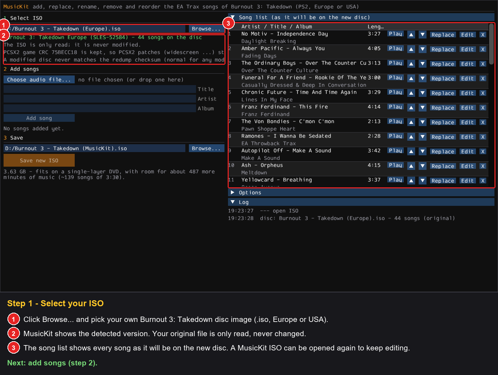
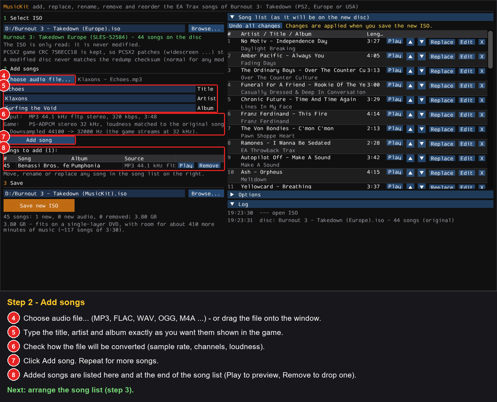
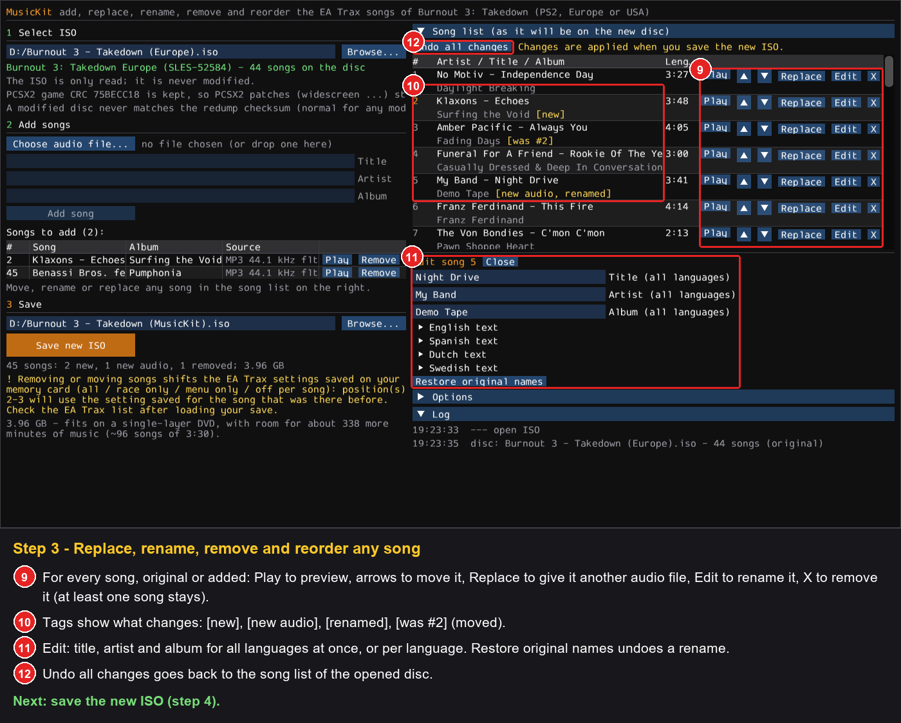
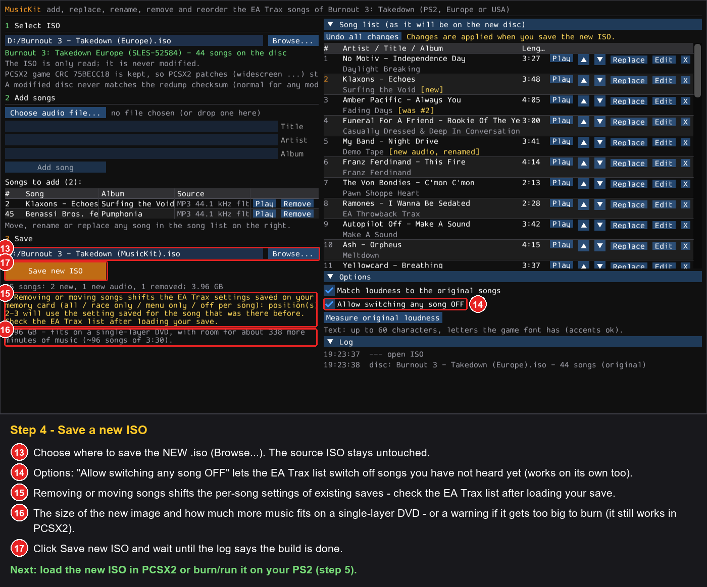
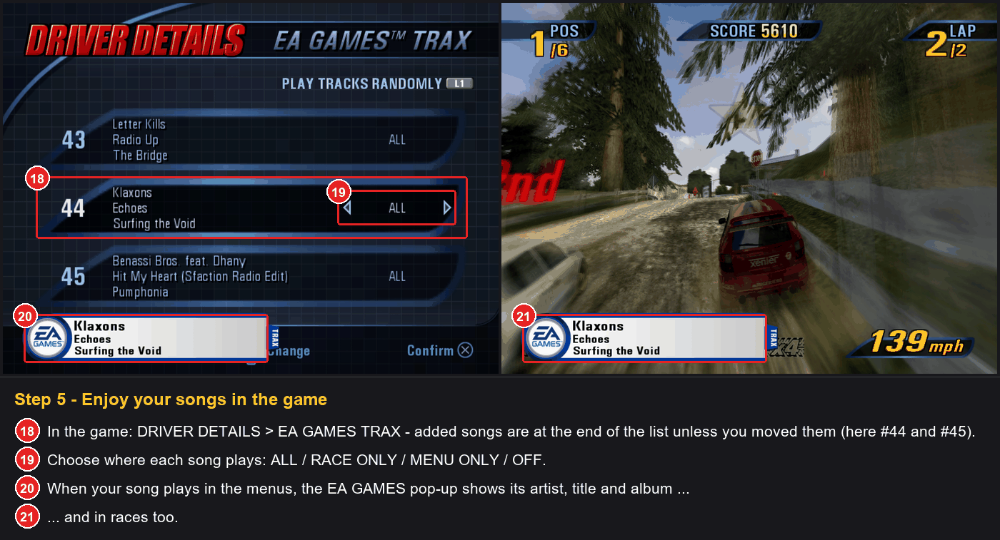

# MusicKit for Burnout 3: Takedown (PS2)

**Add your own songs to the EA Trax soundtrack of Burnout 3: Takedown** — with their title, artist and album — and
get a new disc image that plays them in the game just like the original songs: in menus and races, in the
**EA GAMES™ TRAX** list, and in the now-playing pop-up. You can also **replace, rename, remove and reorder** any
song, the original ones included.

> **Unofficial fan-made tool.** Not affiliated with, endorsed or sponsored by Electronic Arts Inc. or Criterion
> Games. You need **your own copy** of the game. See [Legal](#legal) before you use or share anything.

- Works with your own disc image of **Burnout 3: Takedown for PlayStation 2**:
  - Europe / Australia — `SLES-52584` (English, Spanish, Dutch and Swedish texts)
  - USA — `SLUS-21050`
- Your original image is **only read, never modified**; MusicKit writes a **new** `.iso`.
- Songs: MP3, FLAC, WAV, OGG, M4A … (anything ffmpeg can read), up to 95 songs in total.
- Add, replace, rename, remove and reorder songs — and reopen an image MusicKit made to keep editing it.
- Optional: **Allow switching any song OFF** in the game's EA Trax list (see [below](#allow-switching-any-song-off)).
- The new image keeps the game's PCSX2 CRC (`75BECC18` Europe, `BEBF8793` USA), so **PCSX2 still recognises the
  game and applies its patches** (widescreen etc.).
- **Tested in PCSX2** with the European disc: songs added after the original 44 appear in **Driver Details →
  EA GAMES™ TRAX** and play with their pop-up in menus and in races. The USA version is supported and checked
  automatically by MusicKit.

---

## How it works — 5 steps

### Step 1 — Select your ISO

### Step 2 — Add songs

### Step 3 — Arrange the song list (optional)

### Step 4 — Save a new ISO

Before you save, MusicKit shows the size of the new image and how much more music still fits on a single-layer
DVD (4.7 GB) — calculated from *your* image. If it would not fit, you see a warning; you can still save it (see
[FAQ](#faq)).

### Step 5 — Play
Load the new `.iso` in PCSX2 (or burn it / run it on your PS2) and open **Driver Details → EA GAMES™ TRAX**.

---

## Guides

Nothing is written until you click **Save new ISO** — every change below is only collected in the song list
(right side), which shows the soundtrack exactly as it will be on the new disc. **Undo all changes** goes back to
the song list of the opened image.

### Add songs
*Choose audio file…* (or drop files on the window), type title / artist / album, click **Add song**. New songs are
added at the end of the list; move them anywhere with ▲ / ▼.

### Replace a song's audio
Click **Replace** next to any song (original or added) and choose another file. The song keeps its place, its
names and its EA Trax setting — rename it too with **Edit** if you like. **Play** previews the new audio exactly
as the game will play it.

### Rename a song (per language)
Click **Edit**: the three fields change title, artist and album for **all languages** at once. Open *English
text*, *Spanish text*, *Dutch text*, *Swedish text* (European disc) to set a different text for one language only.
**Restore original names** undoes a rename of an original song.

### Remove songs
Click **X** to remove a song — original songs too. At least one song must stay on the disc.

### Reorder songs
Use ▲ / ▼ to move a song. Moved songs are tagged *[was #N]* with their old position.

### Reopen a MusicKit ISO and keep editing
Select an image MusicKit made in step 1: its current song list is read back from the disc (added and replaced
songs are recognised). Change it like any other image and save another **new** `.iso`.

### Allow switching any song OFF
In the original game the EA Trax list only lets you switch a song **OFF** after it has played to the end once —
until then it only offers ALL / RACE ONLY / MENU ONLY. Tick **Options → Allow switching any song OFF** before
saving to lift that lock for every song. It can also be the only change: open your image, tick the option, save.
Images that already have it show *"This disc already lets you switch every song OFF"*.

### Save games: removing or reordering songs
The game stores the EA Trax setting of positions **1–44** (ALL / RACE ONLY / MENU ONLY / OFF) on the memory card
**by position**, not by song. Adding songs, replacing audio and renaming keep every setting where it is.
**Removing or moving songs** among positions 1–44 shifts those settings: a song that ends up at another position
uses the setting saved for that position. MusicKit shows a warning with the affected positions before you save.
**What to do:** after loading your save with the new image, open the EA Trax list once, set those songs the way
you want and save your game.

### Song names and the game's text memory
The game keeps all its texts of one language in a fixed amount of memory, and the names of added songs go there
too. MusicKit checks this for every language before you save. There is room for the names of dozens of added
songs (with typical names, up to the 95-song limit); only very long titles, artists and albums on many songs can
run out of room. MusicKit then tells you how many characters to remove, and *Save new ISO* stays disabled until
the names fit. Names of removed songs make room for new ones.

---

## Requirements

| What | Details |
|---|---|
| Operating system | Windows 10 or 11 (64-bit) |
| Python | 3.11 or newer — <https://www.python.org/downloads/> |
| Python packages | installed automatically by `setup.bat` into a private `.venv`: numpy, numba, glfw, PyOpenGL, imgui-bundle, Pillow, soundfile, pyloudnorm, pycdlib, pytest (see [requirements.txt](requirements.txt)) |
| ffmpeg | downloaded automatically by `setup.bat` (or install it yourself: `winget install Gyan.FFmpeg`) |
| Graphics | any GPU with OpenGL 3.3 (for the MusicKit window) |
| Disk space | about 5 GB free for the new disc image (~3–4 GB) plus ~1 GB for Python packages and ffmpeg |
| The game | your own disc image (.iso) of Burnout 3: Takedown for PS2: Europe `SLES-52584` or USA `SLUS-21050` |
| Internet | only once, during `setup.bat` |

## Installation (Windows 10 / 11)

1. Install **Python 3.11 or newer** from <https://www.python.org/downloads/> (tick *"Add python.exe to PATH"*).
2. Download this repository (green **Code** button → *Download ZIP*) and unpack it, or `git clone` it.
3. Double-click **`setup.bat`** once. It creates a private Python environment in `.venv` and downloads
   **ffmpeg** into the `ffmpeg` folder (used to read MP3/FLAC/OGG/… files). Nothing is installed system-wide.
   - If the ffmpeg download fails, install it yourself (`winget install Gyan.FFmpeg`) or put `ffmpeg.exe` and
     `ffprobe.exe` into `ffmpeg\bin`.
4. Start **`MusicKit.bat`**.

## Sound quality

The game streams its music as **PS2 ADPCM, stereo, 32 kHz** — every song is converted to that format:

| Your file | What happens |
|---|---|
| CD quality or better (44.1 / 48 / 96 kHz, 16/24-bit) | downsampled to 32 kHz (the best the game can play) |
| lower than 32 kHz (e.g. 22 kHz) | upsampled — it plays fine, but quality cannot get better than the source |
| mono | copied to both channels |
| more than 2 channels | mixed down to stereo |

Loudness is matched to the original EA Trax songs, so your songs are neither louder nor quieter than the rest
(you can turn this off under *Options*). Titles, artists and albums can be up to 60 characters; characters the
game's font does not have are replaced by the closest one (accents are kept).

## Command line (optional)

Everything the window does is also available from `musickit-cli.bat`. Song numbers are positions in the pending
list shown by `queue` (the same as `list` until you change something).

| Task | Command |
|---|---|
| show the songs of an image | `list --iso "Burnout 3 - Takedown (Europe).iso"` |
| add a song | `add song.flac --title "My Song" --artist "My Band" --album "My Album"` |
| replace a song's audio | `replace 5 other.flac --iso "Burnout 3 - Takedown (Europe).iso"` |
| rename (all languages / one language) | `edit 7 --title "New Title" --artist "New Artist"` · `edit 7 --album-sp "Nuevo Album"` |
| remove a song from the disc | `remove-song 12` |
| move a song | `move 44 1` · `move 44 up` · `move 44 down` |
| show the pending list | `queue` |
| forget all pending changes | `reset` |
| save the new image | `build --iso "Burnout 3 - Takedown (Europe).iso" --out "Burnout 3 - Takedown (MusicKit).iso"` |
| … and allow switching any song OFF | add `--unlock-off` to `build` (also works without any other change) |
| check a new image | `validate "Burnout 3 - Takedown (Europe).iso" "Burnout 3 - Takedown (MusicKit).iso"` |

Per-language options: `--title-en`, `--title-sp`, `--title-du`, `--title-sw` (European disc), `--title-us` (USA
disc), and the same for `--artist-…` and `--album-…`.

`remove` (without `-song`) removes a queued *new* song; `remove-song` removes a song from the disc.

`validate` re-reads the new image and checks it: the file system is consistent, every file MusicKit did not change
is byte-identical, the PCSX2 CRC is unchanged, the known PCSX2 patches for the game do not touch anything MusicKit
changed, the song list is consistent, the song names fit into the game's text memory and new or replaced songs
decode; it also tells you whether the image fits on a single-layer DVD.

## FAQ

**PCSX2 says the dump is not in the redump database / the MD5 is red.** That is expected for *any* modified disc
image — it simply is not the original pressing anymore. It does not affect the game or PCSX2 patches: the game CRC
(shown in PCSX2's game properties) stays the same.

**Can I change the songs again later?** Yes. Open the image MusicKit made and add, replace, rename, remove or
reorder songs; MusicKit reads the current song list back from that image.

**Will my save game still work?** Yes. Adding songs, replacing audio and renaming keep every EA Trax setting where
it is; new songs default to *ALL* (menus and races). The game saves the setting of the first 44 positions only, so
songs after position 44 come back as *ALL* after loading a save. Removing or moving songs shifts the saved
settings of positions 1–44 — see [Save games](#save-games-removing-or-reordering-songs).

**How many songs can the disc have?** From 1 up to 95 songs in total.

**My songs don't show up.** Make sure you started the *new* `.iso`. Added songs are at the end of the EA GAMES TRAX
list unless you moved them.

**MusicKit says the song names do not fit.** See
[Song names and the game's text memory](#song-names-and-the-games-text-memory): shorten some titles, artists or
albums (the message tells you by how much), or add fewer songs.

**Why does MusicKit warn that my image is too big to burn?** A normal (single-layer) DVD holds 4.7 GB. With a lot
of added or long songs the new image can get bigger than that. It still works in emulators such as PCSX2, but it
cannot be burned to a normal DVD for a real PS2 — remove or shorten songs until the warning is gone if you want
to burn it.

**I can't switch some original songs OFF.** That is how the original game works: a song can only be switched OFF
after it has played to the end once. Songs added with MusicKit are never locked. To lift the lock for every song,
use [Allow switching any song OFF](#allow-switching-any-song-off) (command line: `build --unlock-off`). The PCSX2
game CRC stays the same.

## Other Burnout MusicKits

- [Burnout Revenge MusicKit](https://github.com/Bondimm/burnout-revenge-musickit) — the same tool for Burnout
  Revenge (PS2).
- [Burnout Dominator MusicKit](https://github.com/Bondimm/burnout-dominator-musickit) — the same tool for Burnout
  Dominator (PS2).

## Thanks

- Everyone in the community who tested the Burnout Revenge MusicKit and sent feedback — this kit builds on what
  you found.

## Legal

**Please read this before using or sharing anything made with MusicKit.**

- **Unofficial project.** MusicKit is an independent, non-commercial fan project. It is not affiliated with,
  authorised, endorsed or sponsored by Electronic Arts Inc., Criterion Games or Sony Interactive Entertainment.
- **Trademarks.** "Burnout", "Burnout 3: Takedown", "EA", "EA Trax" and related names and logos are trademarks of
  Electronic Arts Inc.; "PlayStation" and "PS2" are trademarks of Sony Interactive Entertainment. They are used
  here only to describe which game this tool works with. All other trademarks belong to their owners.
- **No game content is included.** This repository contains only original source code and documentation, plus
  screenshots used to illustrate how the tool works. It does not contain or distribute any part of the game —
  no disc images, executables, music, textures or other data.
- **Bring your own game.** You need your own, legally obtained copy of Burnout 3: Takedown and must create the disc
  image from it yourself. MusicKit does not bypass any copy protection; it only edits a copy of your own image.
- **Do not share modified disc images.** Disc images contain the game, which is copyrighted by Electronic Arts.
  Uploading or distributing them — modified or not — is not allowed.
- **Music rights.** Songs belong to their artists and labels. Only add music you are allowed to use, keep your
  modified image for personal use, and do not distribute images or files that contain other people's music.
- **No warranty.** The software is provided "as is", without warranty of any kind (see [LICENSE](LICENSE)).
  Use it at your own risk; keep a backup of your original image and your memory card saves.
- **Licence.** The source code is released under the MIT License. The licence applies only to the code in this
  repository and grants no rights to the game or its content.

If you are a rights holder and have a concern about this project, please open an issue and it will be addressed
promptly.
